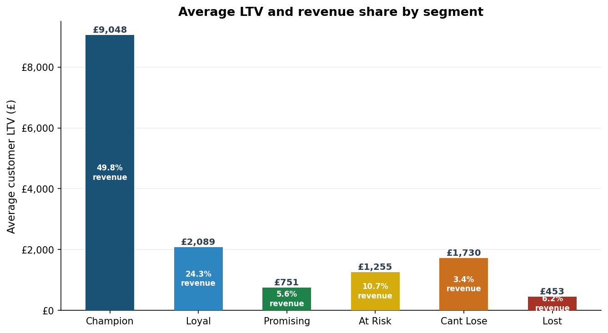
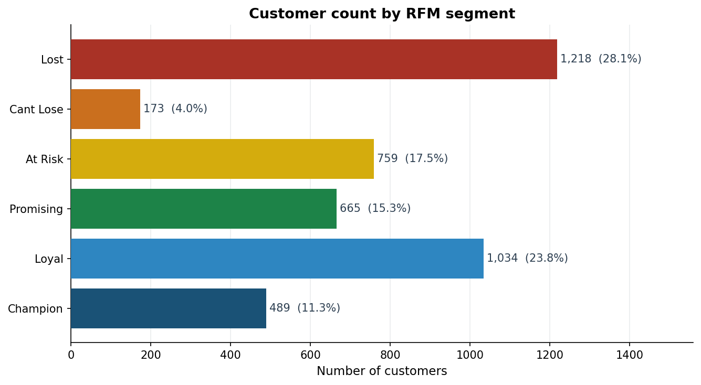
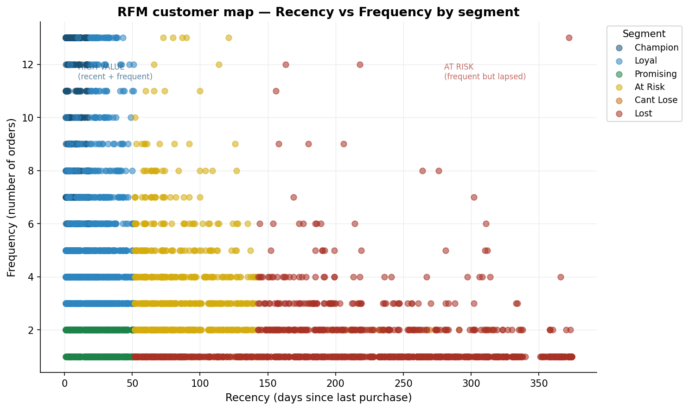
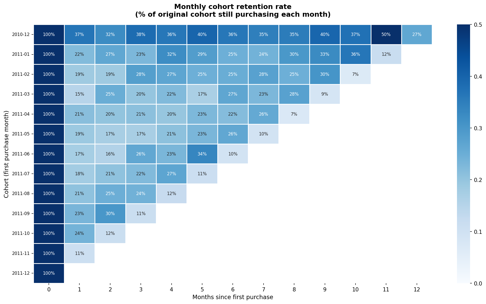
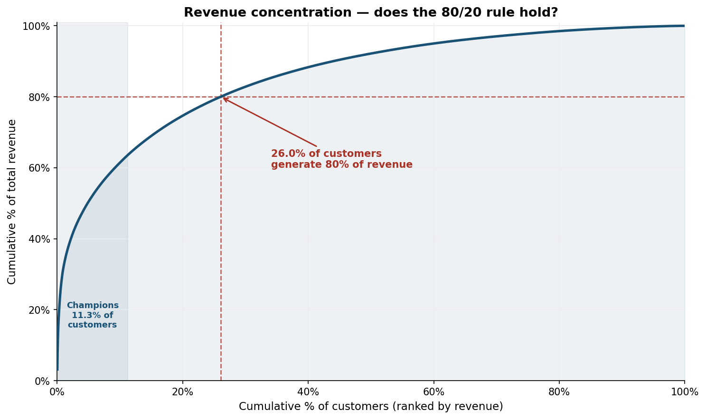

# Customer LTV & RFM Segmentation
### Identifying high-value customers and revenue concentration 
in a UK retail dataset

---

## Overview

Full RFM (Recency, Frequency, Monetary) segmentation and customer 
lifetime value analysis on 541,909 real transactions from a UK 
online retailer — covering 4,338 unique customers across 13 months.

**Key finding: Just 26% of customers generate 80% of total revenue. 
Champions (11.3% of customers) account for 49.8% of all revenue.**

---

## Key results

| Metric | Value |
|---|---|
| Raw transactions | 541,909 |
| Transactions after cleaning | 392,692 |
| Unique customers analysed | 4,338 |
| Date range | Dec 2010 – Dec 2011 |
| Champion avg LTV | £9,048 |
| Lost customer avg LTV | £453 |
| Top 26% of customers generate | 80% of revenue |
| Average month-1 retention | ~20% |
| Largest segment | Lost (28.1%) |

---

## Customer segments

| Segment | Customers | % of Base | Avg LTV | Revenue Share | Action |
|---|---|---|---|---|---|
| Champion | 489 | 11.3% | £9,048 | 49.8% | VIP programme · referral ask |
| Loyal | 1,034 | 23.8% | £2,089 | 24.3% | Loyalty rewards · upsell |
| At Risk | 759 | 17.5% | £1,255 | 10.7% | Win-back campaign |
| Lost | 1,218 | 28.1% | £453 | 6.2% | Low-cost reactivation |
| Promising | 665 | 15.3% | £751 | 5.6% | First repeat purchase incentive |
| Cant Lose | 173 | 4.0% | £1,730 | 3.4% | Urgent re-engagement |

---

## Charts

| | |
|---|---|
|  |  |
|  |  |

---

## Key insights

**1. Revenue is dangerously concentrated.**  
Only 26% of customers generate 80% of revenue — more extreme 
than the classic 80/20 rule. Losing a fraction of Champions 
would have a disproportionate impact on total revenue.

**2. Post-purchase retention is broken.**  
Cohort analysis shows ~80% of new customers never make a 
second purchase. Every monthly cohort shows the same sharp 
cliff after the first order. A structured month-1 re-engagement 
sequence is the highest-ROI intervention available.

**3. December 2010 cohort is the strongest.**  
Retained 35–40% of customers consistently across 12 months — 
likely wholesale or trade buyers with regular order cycles.

**4. At Risk customers represent recoverable revenue.**  
759 customers with avg LTV of £1,255 have slowed down but 
not gone. A time-limited win-back offer sent within 30 days 
could recover 15–25% before they fully disengage.

---

## Methodology

1. Data loading — Excel file with 541,909 transactions
2. Quality checks — nulls, duplicates, data types
3. Cleaning — removed 149,217 rows (nulls, cancellations, 
   negatives, duplicates)
4. Feature engineering — TotalPrice column
5. RFM calculation — Recency, Frequency, Monetary per customer
6. RFM scoring — quartile-based 1–4 scoring per dimension
7. Segment assignment — rule-based using RFM score combinations
8. LTV calculation and segment aggregation
9. Cohort retention matrix — monthly cohort analysis
10. Pareto revenue concentration curve
11. Campaign action recommendations per segment

---

## Tools & technologies

| Tool | Usage |
|---|---|
| Python 3 | Core language |
| Pandas | Data cleaning, RFM calculation, cohort matrix |
| NumPy | Numerical operations |
| Matplotlib | Charts 1, 2, 3, 5 |
| Seaborn | Cohort retention heatmap (Chart 4) |
| Google Colab | Development environment |

---

## Dataset

[UK Online Retail Dataset — UCI Machine Learning Repository](
https://www.kaggle.com/datasets/vijayuv/onlineretail)

Download the dataset from Kaggle and place it in the `data/` 
folder as `OnlineRetail.csv`. See `data/README.md` for full 
instructions.

> Dataset not included in this repository due to file size 
> (45MB) and Kaggle licensing terms.

---

---

## Author

**Sam Mathew** — Marketing Data Analyst · Berlin, Germany  
[LinkedIn](https://www.linkedin.com/in/sammathew07/) · 
sammathew.mj@gmail.com · 
[GitHub](https://github.com/Mathewsam7)
